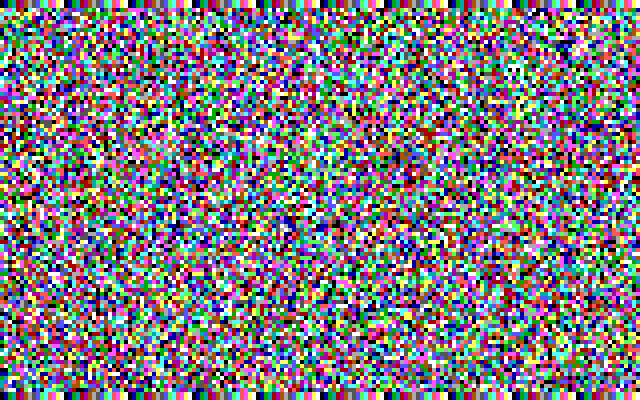

# cgax16demo
CGA and VGA 160x100 16 color pseudo graphics mode demo code

This is example code to demonstrate how to put the CGA and VGA video display controllers into the 160x100 16 color pseudo
graphics mode.

This mode is a "hacked" version of text mode that reduces the character height to increase the number of displayable lines.

The CGA controller uses a Motorola 6845 CRT controller, the 6845 does not directly display data, it simply generates
addresses and sync signals for an attribute controller to display.  The CGA attribute controller is controlled by the CGA
mode register to implement 40x25 and 80x25 text, as well as 320x200 and 640x200 graphics output.

By setting up the 6845 to generate timings consistent with graphics mode, but not setting the attribute controller into
graphics mode you can create a text mode that has 80 characters per line and 100 lines.  The tricks is that the lines are
2 scanlines tall.  CGA has rectangular pixels because it effectively skips a scanline between adjacent lines, so each
line is 1 illuminated scanline and 1 dark scanline.  This is a simplified explanation, but the important characteristic is
that CGA pixels are 2 times higher than they are wide.

The CGA display controller has 8x8 character cells, which are effectively 8x16 pixels in area.  By only displaying the first
2 lines of each character cell you get 4x8 pixel character cells (by area).  The IBM PC extended character set has a
graphics character at ASCII position 222 (0xDE), the first 4 columns are the BG color and the second 4 columns are the FG
color.  This means you have a 4x4 pixel area that represents the BG color and 4x4 area that represents the FG color.

To independently address 16 colors per cell, you must alter the attribute byte for each character on the screen, with the
colors packed as 4 upper bits and 4 lower bits of the attribute byte.

All of this hackery results in 160x100 (16,000) effective 16 color pixels that are square.  The CGA display controller only
has 16384 bytes of memory, of with 16000 is consumed by this display buffer.  This means there is only 1 display page, so
text page flipping will not work.  In normal 80x25 mode there are 8 text pages to choose from, each consuming 2000 bytes of
memory.

For EGA, the mode is emulated by doubling pixels in x and y direction in 320x200 16 color graphics mode.

